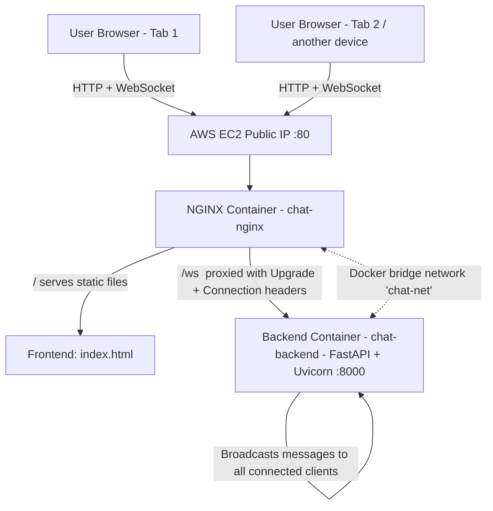

# SpotSure Biz — Real-Time WebSocket Chat: Dockerized Deployment

A FastAPI WebSocket chat application, containerized with Docker, served behind an
NGINX reverse proxy, deployed to an AWS EC2 instance, and automatically redeployed
on every push via a GitHub Actions CI/CD pipeline.

**Live URL:** http://15.207.68.10/
**Repository:** https://github.com/yuvraj-singh009/SpotSure_Biz_Project

---

## 1. Project Overview

This project takes a working but misconfigured containerized chat application and
fixes its Docker, networking, and reverse-proxy setup so it runs correctly in a
production-style environment: multiple users can connect from different browser
tabs/devices and chat in real time over WebSockets, all traffic routed through
an NGINX reverse proxy on port 80.

The backend (FastAPI + WebSockets) and frontend (static HTML/JS) were provided
as-is and were not modified. All fixes were made at the infrastructure layer:
`Dockerfile`, `docker-compose.yml`, and `nginx.conf`.

---

## 2. Architecture Diagram



**Flow:** A browser hits the EC2 public IP on port 80 → NGINX receives it → static
requests are served directly from the mounted frontend folder → WebSocket requests
to `/ws` are proxied (with protocol-upgrade headers) to the FastAPI backend container
over the internal Docker network → the backend broadcasts each incoming message to
every connected client, giving real-time multi-user chat.

---

## 3. How the Docker Containers Are Set Up

Two services, defined in `docker-compose.yml`:

- **`backend`** — built from the project's `Dockerfile` (Python 3.11-slim base,
  installs `requirements.txt`, runs `uvicorn main:app --host 0.0.0.0 --port 8000`).
  Not published to the host — only `expose`d internally, since only nginx needs
  to reach it.
- **`nginx`** — official `nginx:alpine` image, publishes port `80:80` to the host,
  mounts the fixed `nginx.conf` and the `frontend/` directory read-only.

Both are set to `restart: unless-stopped`, so they come back automatically after
a container crash or a server reboot.

---

## 4. How Docker Networking Works

Both containers are attached to a user-defined bridge network, `chat-net`,
declared in `docker-compose.yml`. Docker Compose gives every service on that
network a DNS entry matching its service name. That's what makes
`proxy_pass http://backend:8000/ws;` work inside `nginx.conf` — `backend` resolves
to the backend container's internal IP automatically, with no hardcoded IPs and
no host networking required. This is also why the backend's Dockerfile had to
bind to `0.0.0.0` rather than `127.0.0.1` — a loopback bind only accepts
connections from inside its own container, which would make it unreachable from
the nginx container even with correct DNS.

---

## 5. How the NGINX Reverse Proxy Works

NGINX listens on port 80 and handles two kinds of requests:

- `location /` — serves the static frontend (`index.html` and assets) directly
  from the mounted `frontend/` volume.
- `location /ws` — reverse-proxies to the backend at `http://backend:8000/ws`,
  forwarding the original `Host`, client IP, and protocol headers so the backend
  sees accurate request metadata.

---

## 6. How WebSocket Works Through NGINX

A WebSocket connection starts as a normal HTTP request that asks to be "upgraded."
By default NGINX doesn't forward that upgrade — it would just proxy it as a plain
HTTP request and the connection would fail to persist. The fix in `nginx.conf`:

```nginx
proxy_http_version 1.1;
proxy_set_header Upgrade $http_upgrade;
proxy_set_header Connection "upgrade";
```

`proxy_http_version 1.1` is required because WebSocket upgrades aren't supported
in HTTP/1.0. The two header lines forward the client's upgrade request through to
the backend, and long `proxy_read_timeout`/`proxy_send_timeout` values keep idle
WebSocket connections from being cut off by NGINX's default timeouts.

---

## 7. How the CI/CD Pipeline Works

`.github/workflows/deploy.yml` defines a GitHub Actions workflow triggered on
every push to `main`:

1. GitHub Actions checks out the latest commit.
2. It SSHes into the EC2 server using credentials stored as encrypted repository
   secrets (`SERVER_IP`, `SERVER_USER`, `SERVER_SSH_KEY`).
3. On the server, it runs `git pull`, then `docker compose down` followed by
   `docker compose up -d --build`, rebuilding images with any code changes and
   restarting both containers.

No manual redeploy step is needed after the initial server setup — every push
to `main` automatically ships to production.

---

## 8. Issues Found and How They Were Fixed

| # | Issue | Where | Fix |
|---|-------|-------|-----|
| 1 | Uvicorn bound to `127.0.0.1`, unreachable from other containers | `Dockerfile` | Changed `--host` to `0.0.0.0` |
| 2 | Frontend volume mount was commented out, so NGINX had no static files to serve | `docker-compose.yml` | Uncommented and mounted `./frontend:/usr/share/nginx/html:ro` |
| 3 | `proxy_pass` pointed to `localhost:8000`, which inside the nginx container refers to nginx itself, not the backend | `nginx.conf` | Changed to `http://backend:8000/ws`, resolved via Docker's internal DNS using the Compose service name |
| 4 | WebSocket `Upgrade`/`Connection` headers were commented out, so the HTTP→WebSocket protocol upgrade never happened | `nginx.conf` | Uncommented `proxy_set_header Upgrade $http_upgrade;` and `proxy_set_header Connection "upgrade";`, plus set `proxy_http_version 1.1;` |

---

## 9. Steps to Deploy the Project (from scratch)

```bash
git clone https://github.com/<your-username>/SpotSure_Biz_Project.git
cd SpotSure_Biz_Project
docker compose up -d --build
```

Then visit `http://<server-ip>` in a browser. Open a second tab at the same
address to confirm real-time multi-user chat.

**On a fresh cloud VM (e.g. AWS EC2, Ubuntu 24.04):**
1. Install Docker Engine + Compose plugin.
2. Open inbound port 80 (HTTP) and 22 (SSH) in the instance's security group.
3. Clone the repo and run the command above.
4. For automated redeploys, add `SERVER_IP`, `SERVER_USER`, and `SERVER_SSH_KEY`
   as GitHub repository secrets and push `.github/workflows/deploy.yml` — every
   future push to `main` redeploys automatically.

---

## 10. Tech Stack

Docker · Docker Compose · NGINX · FastAPI · WebSockets · GitHub Actions · AWS EC2 (Ubuntu 24.04)

---

## 11. Known Trade-offs

- SSH (port 22) is open to `0.0.0.0/0` in the security group so GitHub Actions'
  rotating runner IPs can connect for CI/CD. In a stricter production setup this
  would instead go through a bastion host, VPN, or a self-hosted runner to avoid
  exposing SSH to the public internet.
- HTTPS/TLS was out of scope for this assignment's core requirements (listed as
  an optional bonus) — the app is served over plain HTTP.